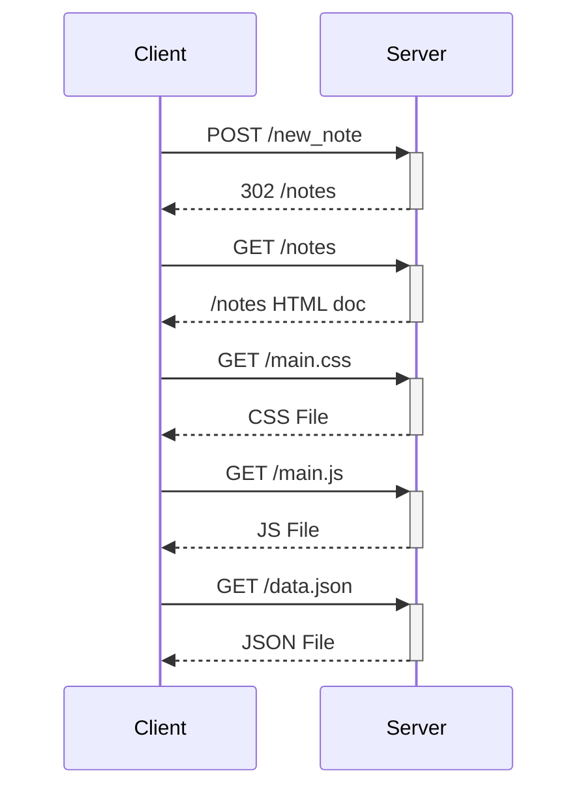
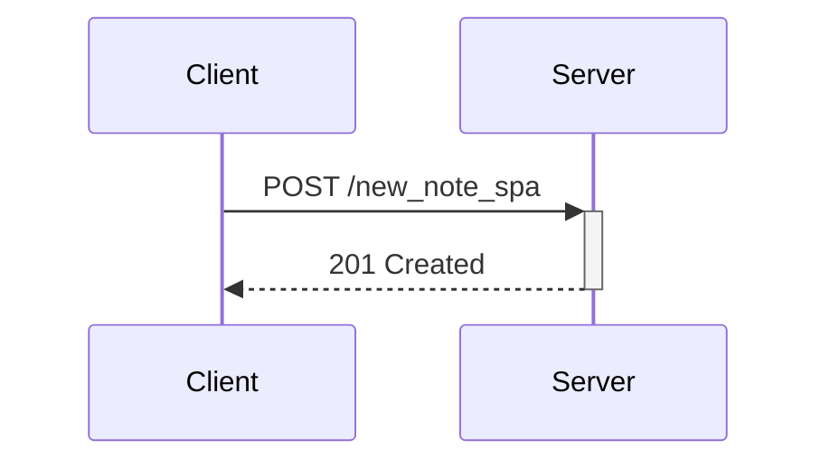

This file contains the exercises for part 0:

Exercise 0.4:

```mermaid
sequenceDiagram

participant Client
participant Server

Client->>+Server: POST /new_note
Server-->>-Client: 302 /notes

Client->>+Server: GET /notes
Server-->>-Client: /notes HTML doc

Client->>+Server: GET /main.css
Server-->>-Client: CSS File

Client->>+Server: GET /main.js
Server-->>-Client: JS File

Client->>+Server: GET /data.json
Server-->>-Client: JSON File
```

Exercise 0.6:

```mermaid
sequenceDiagram
    participant Client
    participant Server
    Client->>+Server: POST /new_note_spa
    Server-->>-Client: 201 Created
```
