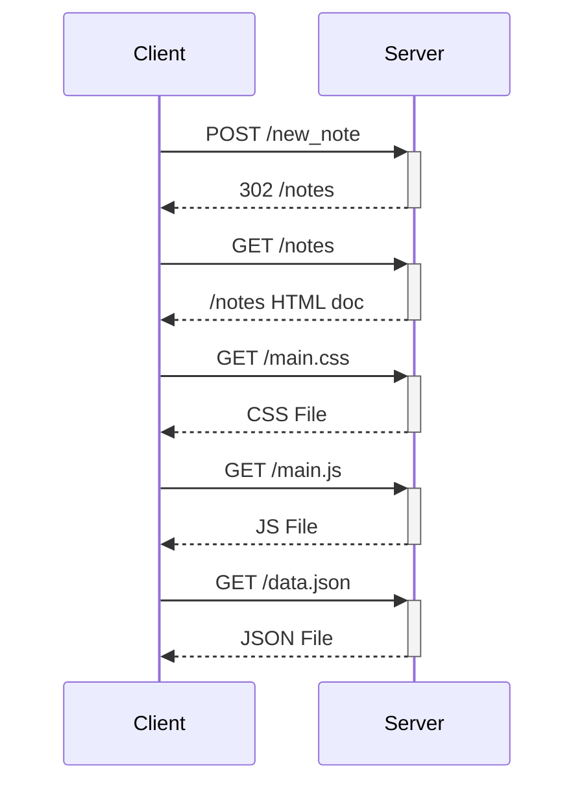
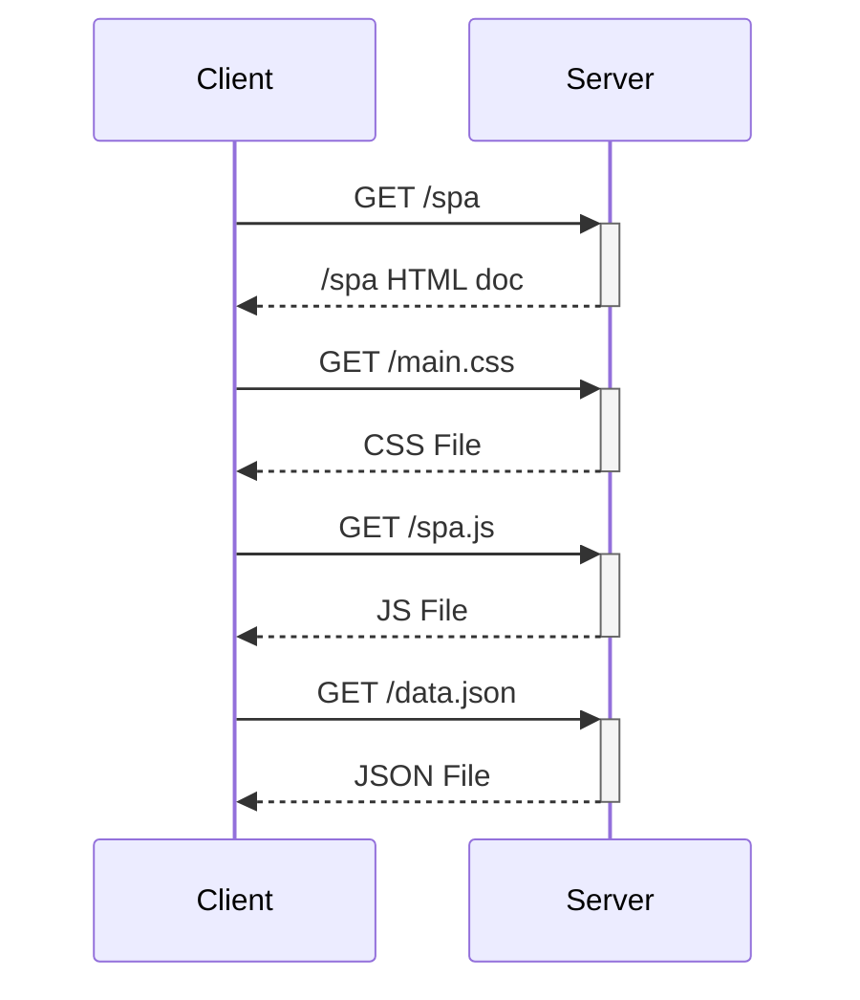
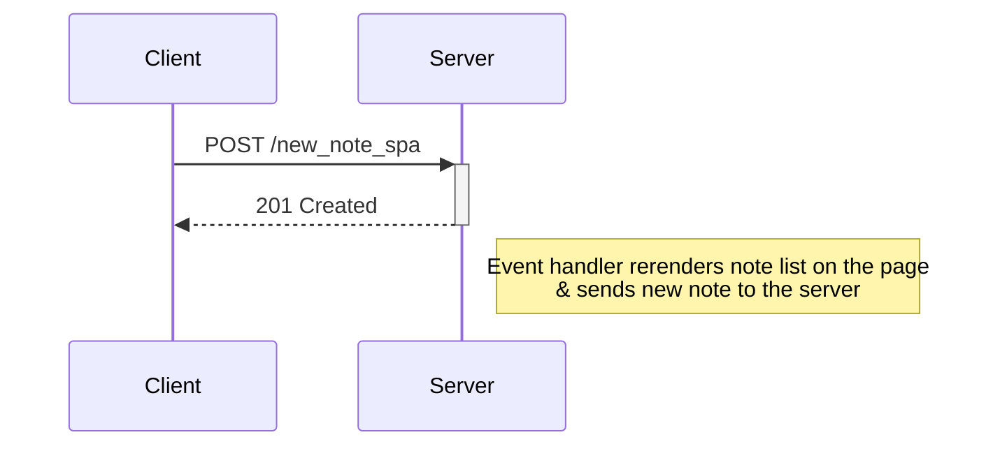

This file contains the exercises for part 0:

Exercise 0.4: User creates new note on traditional example app.

Exercise 0.5: User visits Single Page App

Exercise 0.6: User creates a note on Single Page App

